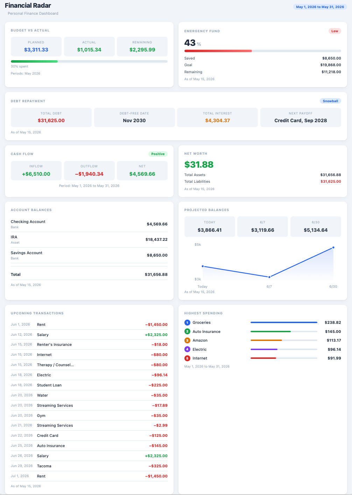
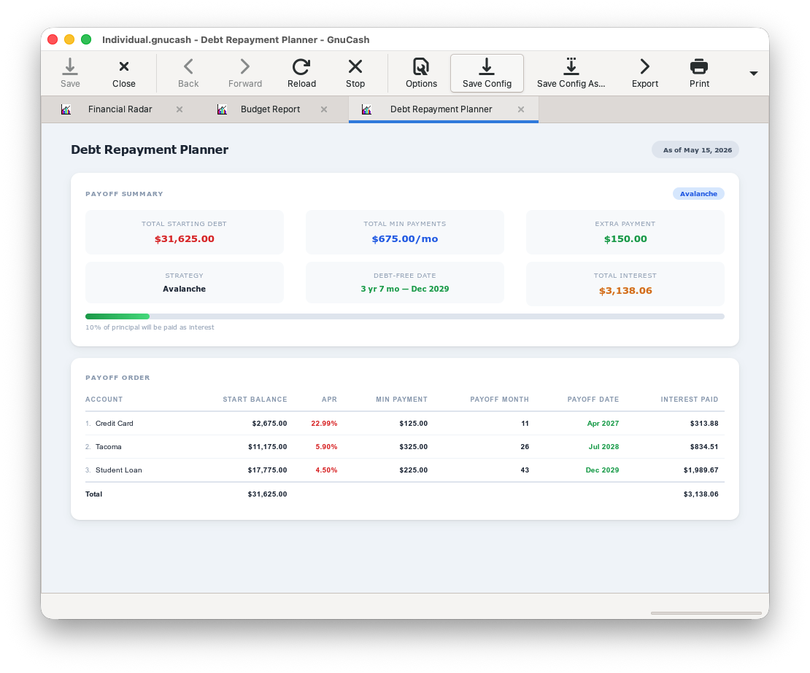
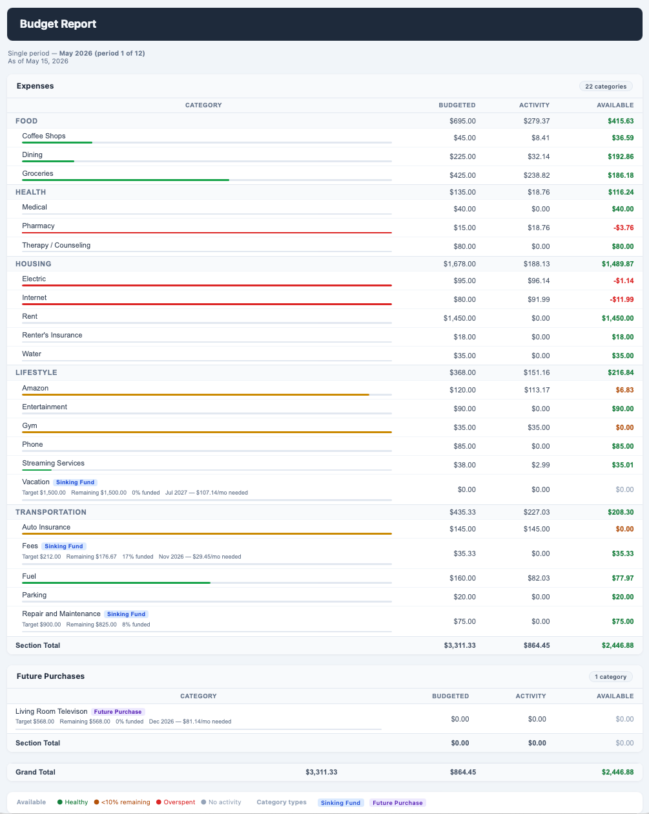

# Financial Radar for GnuCash

Modern dashboard-style reports for GnuCash 5.x.

Financial Radar provides a monthly financial overview, debt repayment summary, projected balances, upcoming transactions, and spending insights from your GnuCash book.

The reports are read-only: they inspect accounts, splits, budgets, and scheduled transactions, but do not modify your GnuCash book.

## Why

GnuCash is a powerful accounting system, but its built-in reports can feel fragmented for day-to-day financial visibility.

Financial Radar aims to provide a more modern, consolidated overview while remaining:

- Local-first
- Read-only
- Compatible with standard GnuCash workflows
- Focused on reporting and planning instead of replacing accounting workflows

## Reports

### Financial Radar

`Financial Radar` is a dashboard-style overview report available from:

```text
Reports > Budget > Financial Radar
```

It includes:

- Budget vs actual spending
- Emergency fund progress
- Cash flow
- Net worth
- Account balances
- Projected balances
- Upcoming scheduled transactions
- Highest spending categories
- Debt repayment summary

The debt repayment summary card reads APR and minimum payment assumptions from account notes (`apr=`, `min-payment=`, `priority=`).

There are two versions:

- `financial-radar.scm`: compatibility version for GnuCash 5.14 Windows portable / older WebKitGTK builds
- `financial-radar-5.15.scm`: modern CSS version for GnuCash 5.15+ / WebKitGTK 2.42+

Load exactly one Financial Radar file at a time. Both register the same report name and GUID.

### Debt Repayment Planner

`Debt Repayment Planner` is available from:

```text
Reports > Budget > Debt Repayment Planner
```

It helps model payoff plans for liability and credit accounts using:

- Minimum-only payments
- Snowball strategy, lowest balance first
- Avalanche strategy, highest APR first
- Custom priority ordering
- Optional extra monthly payment
- Per-debt payoff order
- Optional month-by-month schedule

Debt assumptions are configured via account notes. Open each liability or credit account in GnuCash and add `key=value` lines to its Notes field:

```text
apr=28.49
min-payment=100
priority=1
```

Supported note fields:

| Field | Description |
|-------|-------------|
| `apr` | Annual percentage rate as a number (e.g. `28.49`) |
| `min-payment` | Minimum monthly payment amount |
| `priority` | Integer priority for custom ordering (lower = higher priority) |

Lines starting with `#` or `;` in account notes are treated as comments and ignored. The report reads these fields but never writes to account notes.

### Budget Report with Sinking Funds

`Budget Report with Sinking Funds` is available from:

```text
Reports > Budget > Budget Report with Sinking Funds
```

The visible report header uses the name set in the report options dialog (`Options → General → Report name`). The default is `Budget Report with Sinking Funds`. Changing it to `Budget Report` or any other name updates the rendered title without affecting the menu entry, GUID, or saved report behavior.

It provides a YNAB / Actual Budget-style view of budget categories using:

- Cumulative available balances
- Budgeted, activity, and available totals per category
- Carry-forward overspending, including negative available balances
- First, current, last, or manually selected budget period ranges
- Single-period or multi-period cumulative views
- Optional YTD reference column shown whenever the selected date range is something other than Year to date
- Configurable included accounts (defaults to Assets, Expenses, and Liabilities)
- Separate section card per included account root, plus a Future Purchases section
- Category grouping by the first path segment within each section
- Section subtotals and a grand total
- Optional zero-balance categories
- Optional hidden-account filtering
- Automatic exclusion of `Off Budget` account trees
- Optional compact spending progress bars
- Automatic sinking fund and future purchase badges

Available is calculated as:

```text
Available = Budgeted to date - Activity to date
```

For expense accounts, activity is spending. For asset or liability accounts, activity is the net change recorded in the GnuCash budget actual values. Available does not reflect the account's real-world balance.

Two category types are detected automatically:

- **Sinking Fund**: any visible leaf account with a valid `target=` entry in its account notes (unless it is also a Future Purchase account).
- **Future Purchase**: any leaf account beneath a placeholder account named exactly `Future Purchases`.

No `Sinking Funds` placeholder account is required. Both category types participate in the budget table with the same budgeted, activity, and available calculations as normal categories.

#### Included accounts and section layout

The report scans leaf accounts under the accounts selected in `Options → Accounts → Included Accounts`. The default selection is the book's top-level accounts named `Assets`, `Expenses`, and `Liabilities`, if they exist.

The rendered output is divided into one card per non-empty included-account root, in the order those roots appear in the option, followed by a `Future Purchases` card (if any Future Purchase accounts exist) and a grand total card. Sinking Fund accounts remain inside their natural section. Future Purchase accounts are extracted from their natural section and shown only in the `Future Purchases` card.

#### YTD reference column

When the selected `Options → General → Date range` is anything other than `Year to date`, the report adds an extra `YTD` column to every section table, group header, and totals row. It shows each row's cumulative available balance from the first budget period through today, independent of whatever narrower or offset range (`This month only`, `Last month only`, a custom range, etc.) is currently selected for the main Budgeted/Activity/Available columns. Selecting `Year to date` itself hides the column, since it would just repeat the Available figure already shown.

#### Sinking Fund and Future Purchase planning targets

Add `key=value` lines to any leaf expense account's Notes field in GnuCash to make it a sinking fund planning row:

```text
target=2600
target-date=2027-05-13
```

For a bill that recurs on a fixed cycle (an annual car registration, a quarterly insurance premium, and so on), add `frequency` so the due date advances itself every cycle instead of needing a manual edit after each payment:

```text
target=210
target-date=2026-07-31
frequency=annual
```

Supported fields:

| Field | Format | Description |
|-------|--------|-------------|
| `target` | positive number | Savings goal or purchase amount |
| `target-date` | `YYYY-MM-DD` | Optional deadline |
| `frequency` | `monthly`, `bimonthly`, `quarterly`, `semiannual`, or `annual` (`annually` / `yearly` also accepted) | Optional recurrence cycle. Requires `target-date`, which then acts as a fixed anchor rather than a one-time deadline. |

With `frequency` set, `target-date` is never rewritten by the report. Each render walks the anchor date forward in whole cycles until it reaches the next occurrence on or after today, so a recurring target keeps showing the correct upcoming due date indefinitely with zero manual upkeep. Without `frequency`, `target-date` behaves as a plain one-time deadline, exactly as before.

Lines starting with `#` in account notes are treated as comments and ignored. The report reads these fields but never writes to account notes.

For each Sinking Fund or Future Purchase row with valid planning metadata, the report shows compact planning info below the account name:

- Target amount
- Remaining amount (`max(0, target - funded)`)
- Percent funded (`funded / target`, clamped 0–100%)
- If a target date is set and the (possibly recurrence-advanced) date is in the future: `Month Year — $X/mo needed` (monthly contribution required, based on `remaining` and months until that date — does not require a nonzero budgeted amount)
- If that date is current or past: `Overdue` or `Due now`

`funded` is the account's cumulative available balance from the first budget period through today — the same figure shown in the YTD column — not the Available value for whatever date range is currently selected. This keeps target progress and required monthly contributions accurate regardless of which range you're browsing: viewing a single past or future month no longer makes a sinking fund look unfunded, and any amount saved ahead of a due date (including funding past 100%) automatically carries forward as a head start once `target-date` rolls to the next cycle.

Accounts with a valid `target=` note appear in the table even if they have no budget or spending activity in the selected period range.

Planning metadata warnings are shown in a small amber block above the budget table. They are non-fatal: the rest of the report renders normally.

Rows without any matching target metadata render exactly as they do now.

## Screenshots

### Financial Radar



Monthly financial overview dashboard with:

- Budget tracking
- Projected balances
- Debt repayment summary
- Upcoming scheduled transactions
- Spending insights

### Debt Repayment Planner



Debt payoff planning report with:

- Snowball and avalanche strategies
- Payoff ordering
- Debt-free estimates
- Projected interest totals

### Budget Report with Sinking Funds



Budget carry-forward report with:

- Cumulative available balances
- Sinking fund and future purchase category badges
- Overspent, low, funded, and no-activity status colors
- Group subtotals
- Optional progress bars

## Compatibility

Tested with:

- GnuCash 5.14 Windows portable
- GnuCash 5.15 on macOS

Use `financial-radar.scm` for GnuCash 5.14 (portable) compatibility. Use `financial-radar-5.15.scm` for GnuCash 5.15+.

`budget-sinking-funds.scm` is intended for GnuCash 5.14+ on Windows, macOS, and Linux.

The 5.15 version uses newer CSS support and looks substantially better. The 5.14 version is functional and compatible, but it has accepted its role as the sensible shoes release.

## Scope

These reports are intended to improve financial visibility and planning inside GnuCash through modern dashboard-style reporting.

They provide:

- Financial overviews
- Budget and spending summaries
- Budget carry-forward and sinking fund visibility
- Scheduled transaction projections
- Debt payoff estimates

They do not modify your GnuCash book or automate financial workflows.

## Files

- `financial-radar.scm`: Financial Radar compatibility report
- `financial-radar-5.15.scm`: Financial Radar modern report for GnuCash 5.15+
- `debt-repayment.scm`: Debt Repayment Planner report
- `budget-sinking-funds.scm`: Budget Report with Sinking Funds
- `config-user.scm`: sample GnuCash user config that loads the reports

## Installation

Copy this repository folder into your GnuCash user data directory as `financial-radar`.

Common locations:

```text
macOS:   ~/Library/Application Support/GnuCash/financial-radar
Linux:   ~/.local/share/gnucash/financial-radar
Windows: %APPDATA%\GnuCash\financial-radar
```

Then add `load` lines to your GnuCash `config-user.scm`.

The included `config-user.scm` is a sample:

```scheme
;; Financial Radar Dashboard (use financial-radar-5.15.scm on GnuCash 5.15+ macOS)
(load (gnc-build-userdata-path "financial-radar/financial-radar.scm"))
;; Debt Repayment Planner - compatible with 5.14 and 5.15
(load (gnc-build-userdata-path "financial-radar/debt-repayment.scm"))
;; Budget Report with Sinking Funds
(load (gnc-build-userdata-path "financial-radar/budget-sinking-funds.scm"))
```

For GnuCash 5.15+, use the modern Financial Radar report instead:

```scheme
(load (gnc-build-userdata-path "financial-radar/financial-radar-5.15.scm"))
(load (gnc-build-userdata-path "financial-radar/debt-repayment.scm"))
(load (gnc-build-userdata-path "financial-radar/budget-sinking-funds.scm"))
```

After editing `config-user.scm`, restart GnuCash.

## Configuration

Open each report, then use the report options to select the accounts, budgets, date ranges, and display preferences you want.

Financial Radar options are grouped by:

- General
- Net Worth
- Cash Flow
- Emergency Fund
- Account Balances
- Upcoming Transactions
- Projected Balances
- Budget

Debt Repayment Planner options are grouped by:

- Debts
- Strategy
- Display

Budget Report with Sinking Funds options are grouped by:

- General: budget selection, date range, period pickers
- Accounts: show zero-balance categories, included accounts, exclude off-budget, hidden accounts, liability activity: payments only
- Display: spending progress bars

## Notes

- Parent account selections are expanded to include descendant accounts where the report needs transaction or balance data.
- Budget cards require a GnuCash budget and selected expense accounts.
- Budget Report with Sinking Funds uses the selected GnuCash budget and scans leaf accounts under the accounts selected in `Included Accounts`. The default is the book's top-level `Assets`, `Expenses`, and `Liabilities` accounts.
- Any visible leaf account with a valid `target=` in its account notes is automatically classified as a Sinking Fund. No `Sinking Funds` placeholder account is required.
- Future Purchase badges require a placeholder account named exactly `Future Purchases` somewhere above the leaf account.
- Planning targets are set via account notes (`target=`, `target-date=`, `frequency=`). The report reads these fields but never writes to account notes.
- `frequency=` makes `target-date` a recurring anchor instead of a one-time deadline: the report computes the next on-or-after-today occurrence at render time and never edits the note itself.
- Debt assumptions are read from account notes (`apr=`, `min-payment=`, `priority=`). The report reads these fields but never writes to account notes.
- By default, Budget Report with Sinking Funds calculates Activity for every account (including liabilities and credit cards) as the net of that account's budget actuals — payments and charges offset each other. Enabling `Accounts → Liability activity: payments only` changes Activity for liability and credit-card accounts to count only the gross payments that reduce the balance; charges, interest, fees, and payment reversals are excluded. This option affects liability/credit-card accounts only — Activity for expense, asset, income, and equity accounts is unchanged either way, and net activity remains the default.
- Upcoming transactions depend on scheduled transaction data in the book.
- Projected balances estimate today, midpoint, and end-of-range balances from selected accounts using entered register transactions plus scheduled transaction cash flow, using the Upcoming Transactions look-ahead period.

## Limitations

- The reports rely on manual option setup. They do not automatically discover which accounts belong in each card.
- Totals assume the selected accounts are comparable in one currency/commodity. There is no exchange-rate conversion across mixed-currency account selections.
- Financial Radar budget totals include full budget periods whose period start falls inside the selected date range. It does not prorate partial budget periods.
- Budget Report with Sinking Funds totals whole GnuCash budget periods only. It does not prorate partial periods or use arbitrary calendar date ranges.
- Budget Report with Sinking Funds includes only visible leaf accounts under the `Included Accounts` selection. Parent accounts are used for grouping, hidden-account filtering, and `Off Budget` subtree exclusion, not as direct budget rows.
- Budget Report with Sinking Funds classifies an account as a Sinking Fund when it has a valid `target=` note and is not a Future Purchase. Future Purchases are detected only by the exact placeholder account name `Future Purchases`; there is no option to use a different name.
- Budget Report with Sinking Funds calculates available as budgeted minus activity across the selected budget periods. It does not model cash envelopes, account transfers, goals, rollover caps, or separate real-world savings balances. The available value for asset or liability accounts reflects GnuCash budget activity only, not the account's actual balance.
- Sinking Fund / Future Purchase "funded so far" (and the YTD column) is cumulative from the first period of the *currently selected* GnuCash budget through today. If you start a new Budget object each fiscal year rather than continuing periods within one budget, that cumulative total restarts at $0 in the new budget even though real-world savings carried over — there is no cross-budget carryover mechanism.
- `frequency=` recurrence covers monthly, bimonthly, quarterly, semiannual, and annual cycles anchored to a single `target-date`. It does not support arbitrary custom intervals, multiple due dates per account, or day-of-month precision — occurrences are resolved to a calendar month, not an exact day.
- Budget Report with Sinking Funds uses absolute values for budget actual totals, so unusual account signs or journal corrections may need review in the underlying GnuCash budget data. When `Liability activity: payments only` is enabled, eligible liability/credit-card accounts instead sum posted, non-voided splits that reduce the balance within the selected budget periods, using the account's own commodity (no currency conversion).
- Cash flow follows split signs on the selected cash/asset accounts, similar to GnuCash's built-in Cash Flow report. Selecting income, expense, or liability accounts can produce confusing results.
- Upcoming Transactions uses scheduled transaction data. Projected Balances uses entered register transactions plus scheduled transaction data. They do not forecast from historical spending patterns.
- The Financial Radar projected balance card uses the Upcoming Transactions look-ahead period as its projection horizon.
- Debt assumptions are read from account notes. Selected debt accounts with no `apr=` or `min-payment=` note fields are excluded from payoff calculations and produce a warning.
- Debt payoff estimates use a simplified monthly model: APR divided by 12, fixed minimum payments, optional fixed extra payment, and no new charges, fees, promotional rates, variable rates, or exact statement due dates.
- The Debt Repayment Planner caps simulations at the configured max projection months, and its optional monthly schedule displays only the first 24 months.
- Load only one Financial Radar file at a time. `financial-radar.scm` and `financial-radar-5.15.scm` register the same report name and GUID.

## License

This project is free software released under the GNU General Public License,
version 2 or later. See [COPYING](COPYING) for the full license text.
